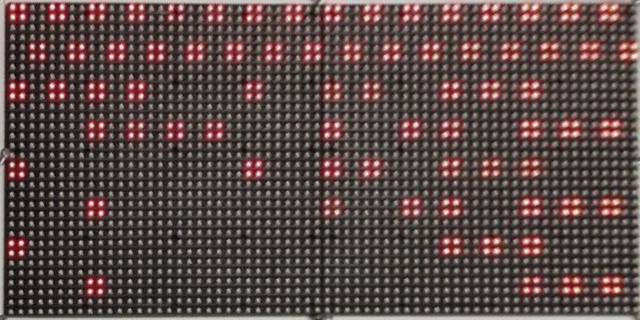

****** IMPORTANT *******

This example will run on Python3.8 and OpenCV4.

There are some assumptions:
  1. The input is the result of YOLO sign detection (example: data/images/panel.jpg)
  2. The top left bit is always on
  3. The resolution is high enough
  4. The image size is 640x320
  5. There is no rotation in the image
  6. There is no perspective in the image
  7. All panels are the same size (64x32)

Usage:
    
        python3 main.py --source path/to/image
    
Example:
        
        python3 main.py --source data/images/panel.jpg

or use default path:
        
        python3 main.py

Input Image:

Output:

    1 0 1 0 1 0 1 0 1 0 1 0 1 0 1 0 1 0 1 0 1 0 1 0 1 0 1 0 1 0 1 0
    0 1 0 1 0 1 0 1 0 1 0 1 0 1 0 1 0 1 0 1 0 1 0 1 0 1 0 1 0 1 0 1
    1 0 1 0 1 0 1 0 0 0 0 0 1 0 0 0 1 0 1 0 0 0 1 0 1 0 1 0 0 0 0 0
    0 0 0 0 1 0 1 0 1 0 1 0 0 0 0 0 1 0 0 0 1 0 1 0 0 0 1 0 1 0 1 0
    1 0 0 0 0 0 0 0 0 0 0 0 1 0 0 0 1 0 1 0 0 0 1 0 1 0 1 0 0 0 0 0
    0 0 0 0 1 0 0 0 0 0 0 0 0 0 0 0 1 0 0 0 1 0 1 0 0 0 1 0 1 0 1 0
    1 0 0 0 0 0 0 0 0 0 0 0 0 0 0 0 0 0 0 0 0 0 1 0 1 0 1 0 0 0 0 0
    0 0 0 0 1 0 0 0 0 0 0 0 0 0 0 0 0 0 0 0 0 0 0 0 0 0 1 0 1 0 1 0
